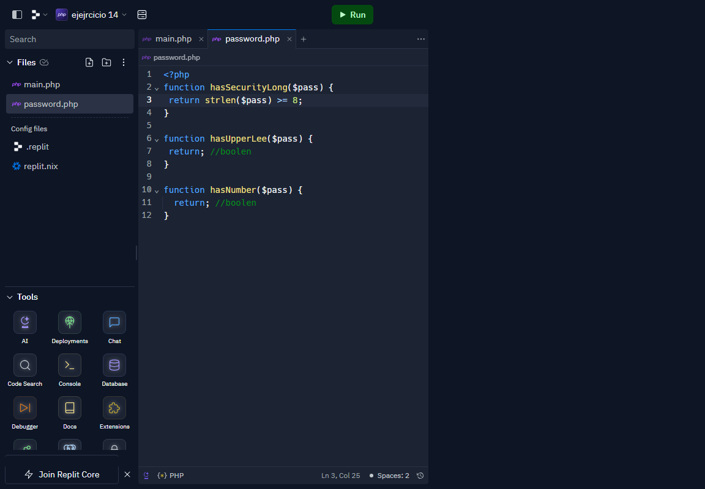

<H1>TALLER 10 - Kevin Santiago Cuitiva bocanegra</H1>

<h2>Informacion</h2>

Curso: full stack grupo 1

Profesor: cristian patiño

<h2>punto-1: constantes y variables</h2>

 </img>

<h2>punto-2: Suma de Constantes y Variables</h2>

</img>

<h2>punto-3: suma de dos numeros indicados por el usario</h2>

</img>

<h2>punto-4: Datos del usarios de consola</h2>

</img>

<h2>punto-5: entrada de bolera usando if/else</h2>

</img>

<h2>punto-6: Detecion de mayor de edad</h2>

</img>

<h2>punto-7: seleccion de operacion arimetrica</h2>

</img>

<h2>punto-8: entre de bolera usando switch</h2>

</img>

<h2>punto-9: tabla de multiplicar usando while</h2>

</img>

<h2>punto-10: numeros pares usando while</h2>

</img>

<h2>punto-11: numros impares usando for</h2>

</img>

<h2>punto-12: tabla de multiplicacion usando for</h2>

</img>

<h2>punto-13: suma de valores de un arreglo usando foreach</h2>

</img>

<h2>punto-14: Revision de contraseña</h2>

</img>
</img>

<h2>punto-15: selecione </h2>

</img>
</img>
